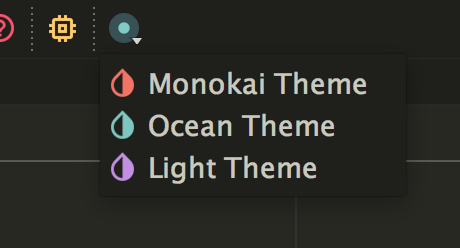
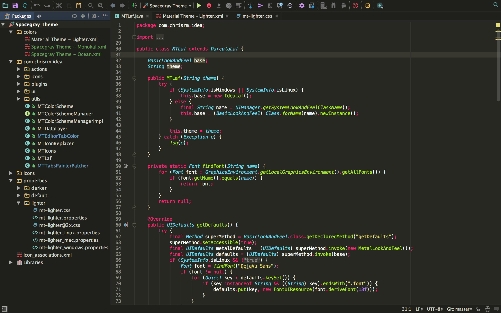
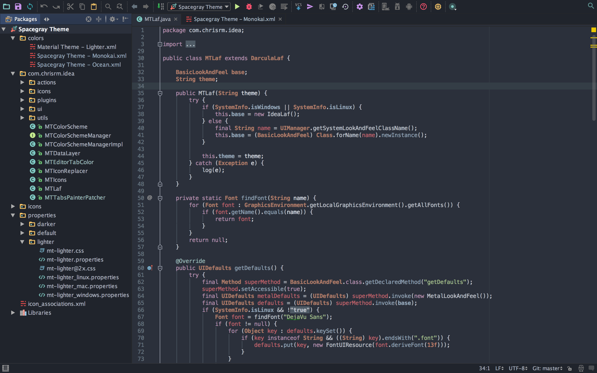
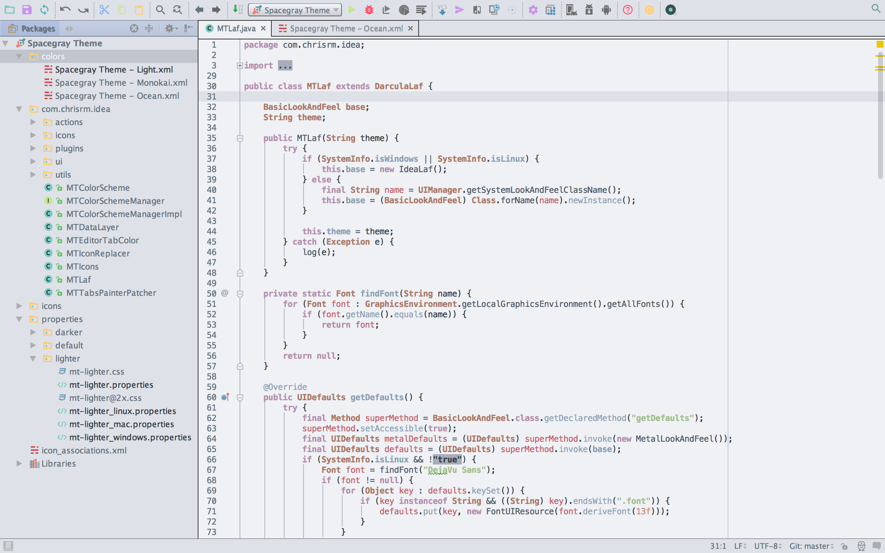

# Spacegray Theme UI for Jetbrains

This is a [Spacegray Theme](https://github.com/kkga/spacegray) port of both the IDE and Color scheme for JetBrains products.
The ported themes were generated from Spacegray's base16 color scheme, with the exception of the Monokai/Eighties theme.

**Please note:** This is a work in progress. There are some work to be done before this can be considered stable.

## Plugin
* [Support](#supported-ides)
* [Installation](#installation)
* [Screenshots](#screenshots)
* [Credits](#credits)

## Supported IDEs

Thanks to the awesome guys at [JetBrains](https://www.jetbrains.com/) the plugin is now supported on pretty much all IDEs from the same company. There are still some work to do to get it perfect on all IDEs, but we're close.

* Any JetBrains IDE (I haven't tested all of them, but I'm pretty certain it should work on the majority)
* Android Studio is partly supported

_EAP releases only partly supported_

## Installation
### _Not on the plugin repository at this time. To install, load the [latest Spacegray Theme.zip](https://github.com/el1t/spacegray-theme-jetbrains/releases) using the "Install plugin from disk" option._

### Set color scheme (code)
This plugin will not set the new color scheme for you, as that would cause a couple problems. You need to set the new color scheme manually:

1. Open the **Settings/Preferences** dialog again.
2. In the left-hand pane, select **Editor** -> **Colors & Fonts**.
3. In the **Scheme** dropdown, you'll find 3 new schemes: `Spacegray Theme - Ocean`, `Spacegray Theme - Monokai` and `SpacegrayTheme - Light`.
4. Choose the scheme you like and hit **Apply** and **OK**.

Shortcut: <kbd>Ctrl+\`</kbd> (that's a backtick) then hit `1. Color scheme` and select your desired color scheme. ## Development

### Requirements

* JDK 1.8

### Building from the command line

`./gradlew clean build`

### Running a test instance with the plugin

`./gradlew runIdea`

### Developing using IntelliJ

Import the project from the `build.gradle` file and develop as normal.  Make
sure you select JDK 8 in the import wizard.  The other defaults are fine.  You
can run the above mentioned CLI Gradle tasks directly in the "Gradle" Tool
Window, which expands from the right side of the screen.  To debug, find
"runIdea" in the list, right-click it, and choose Debug.

## Screenshots
#### Choose theme

#### Monokai/Eighties theme

#### Ocean theme

#### Light theme

# Credits
### Spacegray Theme
Original theme by [kkga](https://github.com/kkga)

### Material Theme to Jetbrains Port
[Here](https://github.com/ChrisRM/material-theme-jetbrains).
