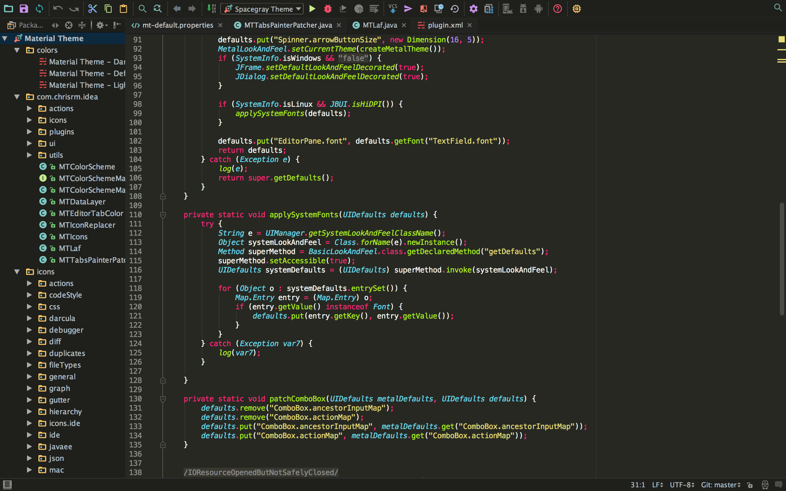

# Spacegray Theme UI for Jetbrains 

This is a [Spacegray Theme](https://github.com/kkga/spacegray) port of both the IDE ~~and Color scheme~~ for JetBrains products. This fork uses warmer colors and removes some unused UI elements.
I have not added regular or light color variations, only a warmer version of Eighties, designed for use with Monokai. If there's interest for any of these please submit an issue.

**Please note:** This is a work in progress. There are some work to be done before this can be considered stable.

## Plugin
* [Support](#supported-ides)
* [Installation](#installation)
* [Contribution](#contribution)
* [Screenshots](#screenshots)
* [Author](#author)

## Supported IDEs

Thanks to the awesome guys at [JetBrains](https://www.jetbrains.com/) the plugin is now supported on pretty much all IDEs from the same company. There are still some work to do to get it perfect on all IDEs, but we're close.

* Any JetBrains IDE (I haven't tested all of them, but I'm pretty certain it should work on the majority)
* Android Studio is partly supported

_EAP releases only partly supported_

## Installation
_Not on the plugin repository at this time. To install, load the zip (or build it yourself) using the "Install plugin from disk" option._

1. [Open the Settings/Preferences dialog](https://www.jetbrains.com/idea/help/accessing-settings.html#openIdeSettings) (OSX/Unix: <kbd>⌘,</kbd>, Windows: <kbd>Ctrl+Alt+S</kbd>)
2. In the left-hand pane, select **Plugins**.
3. Click **Browse repositories...** and search for `Material Theme UI`
4. Click **Install plugin** and confirm your intention to download and install the plugin.
5. Click **OK** in the **Settings** dialog and restart for the changes to take effect.

### Set color scheme
#### _Spacegray syntax scheme(s) not included... yet. But you can install them seperately until they are._
This plugin will not set the new color scheme for you, as that would cause a couple problems. You need to set the new color scheme manually:

1. Open the **Settings/Preferences** dialog again.
2. In the left-hand pane, select **Editor** -> **Colors & Fonts**.
3. In the **Scheme** dropdown, you'll find 3 new schemes: `Material Theme - Default`, `Material Theme - Darker` and `Material Theme - Lighter`. 
4. Choose the scheme you like and hit **Apply** and **OK**.

Shortcut: <kbd>Ctrl+'</kbd> (that's a backtick) then hit `1. Color scheme` and select your desired color scheme. 

## Contribution

I would love to get some help on the colour schemes. Send me a pull request!

## Screenshots
#### Choose theme
_Button removed for now_

#### Darker theme
_Does not exist yet_

#### Default theme

#### Lighter theme

Not yet..

# Author
### Spacegray
Original theme by [kkga](https://github.com/kkga)

### Material Port
Twitter: [@crmag](https://twitter.com/crmag)
